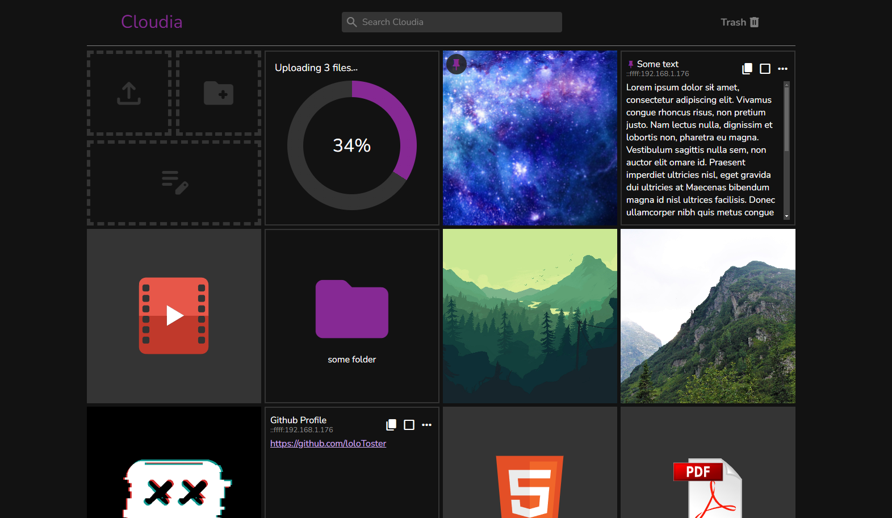
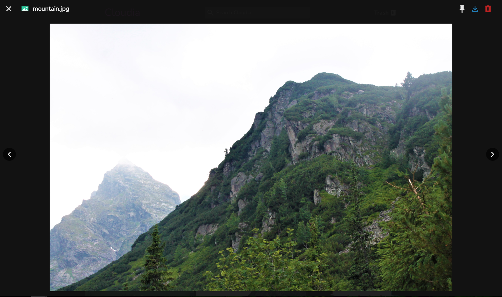

<br>
<br>
<p align="center">

</p>
<br>
<p align="center">
React app created to simplify storing and sharing files 
<br>
between devices in the network.
</p>
<p align="center">


</p>

Table of Contents:
* [About](#about) 
* [Installation](#installation)
* [Docker](#docker)
* [Usage](#usage)
* [CLI](#cli)

# About

<details open>
    <summary>
    --------------------------------------------------------------
    </summary>

The main goal of this app is to simplify the process of quick saving files and text. I found myself many times using some messenger apps like Discord to quickly save some images or pieces of text like links and pieces of code which I didn't want to clutter my desktop with. Or sending some files back to myself because I wanted them on my phone. This app solves all of the described problems and is currently running 24/7 on my Raspberry Pi 🙂

### Preview

<table>
    <tr>
        <td width="1000px">Main Page</td>
        <td width="1000px">File Preview</td>
    </tr>
    <tr>
        <td></td>
        <td></td>
    </tr>
</table>

</details>

# Installation

### 1. Install packages

Default method

```bash
npm install
```

Raspberry Pi method
```bash
# https://stackoverflow.com/questions/31230606/npm-install-sqlite3-takes-forever
# 1. install sqlite
sudo apt-get install libsqlite3-dev
# 2. run install
npm run rPi-install
```

### 2. Build with

```bash
npm run build
```

### 3. Run with
```bash
npm start
```

# Docker
The easiest way to run the app with docker is to use docker compose with following configuration:

```yml
version: '3'

services:
  cloudia:
    restart: always
    image: lolotoster/cloudia:latest
    ports:
      - 3001:3001
    volumes:
      - cloudiadata:/app/data

volumes:
  cloudiadata:
```

but you can also use raw docker:

```bash
docker run -v ./data:/app/data --name cloudia -d lolotoster/cloudia
```

# Usage
The app is designed for intuitive and efficient item management. Items, represented as square elements, can be created, edited, downloaded, pinned, or moved to trash. Special item types include folders, which can hold other items and are easily downloadable with built-in compression, and text items for storing snippets of text.

Trashed items are managed on a dedicated page where they can be restored or permanently deleted. Groups of items can be selected using shortcuts like `Ctrl + click` or `Shift + click`, making bulk actions seamless. Popular file types can be previewed with a simple click, and pinned items stay prioritized at the top.

Everything is optimized for quick, easy, and organized management.

# CLI
The app also offers partial functionality through a CLI tool, which can be built from the source code available in the `cli` directory.
