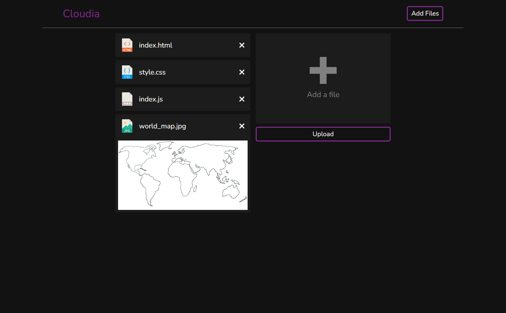
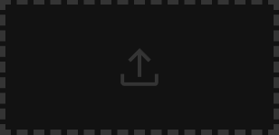
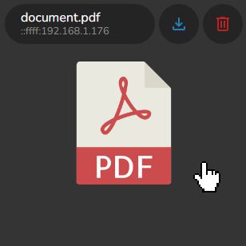
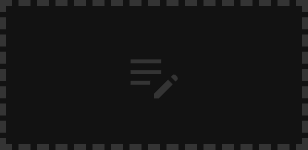
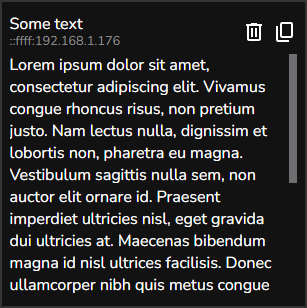

<br>
<br>
<p align="center">

</p>
<br>
<p align="center">
Uncomplicated react app created to simplify storing and sharing files between devices in the network.
</p>
<p align="center">


</p>

Table of Contents:
* [About](#about)
    * [Preview](#preview) 
* [Installation](#installation)
* [Usage](#usage)
    * [Files](#files)
        * [Uploading Files](#uploading-files)
        * [File Item](#file-item)
        * [File Details](#file-details)
    * [Text](#text)
        * [Uploading Text](#uploading-text)
        * [Text Item](#text-item)

# About

<details open>
    <summary>
    --------------------------------------------------------------
    </summary>

The main goal of this app is to simplify the process of quick saving files and text. I found myself many times using some messenger apps like Discord to quickly save some images or pieces of text like links and pieces of code which I didn't want to clutter my desktop with. Or sending some files back to myself because I wanted them on my phone. This app solves all of the described things and is currently running 24/7 on my Raspberry Pi 🙂

### Preview

<table>
    <tr>
        <td width="1000px">Main Page</td>
        <td width="1000px">Add Files Page</td>
    </tr>
    <tr>
        <td></td>
        <td></td>
    </tr>
    <tr>
        <td>Details Page</td>
        <td></td>
    </tr>
    <tr>
        <td></td>
        <td></td>
    </tr>
</table>

</details>

# Installation

### 1. Install packages

Default method

```bash
npm install
```

Raspberry Pi method
```bash
# https://stackoverflow.com/questions/31230606/npm-install-sqlite3-takes-forever
# 1. install sqlite
sudo apt-get install libsqlite3-dev
# 2. run install
npm run rPi-install
```

### 2. Build with

```bash
npm run build
```

### 3. Run with
```
npm start
```

# Usage

Every uploaded file and text is displayed as an item on the main page. An item is a square that contains basic metadata of the item and buttons with quick actions related to it (like downloading or deleting).

## Files

### Uploading files

There are 3 ways to upload files

1. By clicking the Add Files button\


2. By using a quick upload button\


3. By pasting the file anywhere on the main page

### File Item

Every uploaded file is represented as an item on the main page. By hovering over any item the user is presented with a mini menu that consists of some metadata of the file and two buttons: one that downloads the file and the other that deletes it. By clicking on the File Item the user is redirected to the [File Details Page](#file-details). Example of the file item:

<p align="center">

</p>

### File Details

By clicking on any [File Item](#file-item) the user is redirected to the File Details Page. The page consits of the preview of the file, name of the file, ip of the computer that uploaded the file was uploaded from and 3 self-explanatory action buttons


## Text

### Uploading text

There are 2 ways to upload text

1. By using an add text button\


3. By pasting the text anywhere on the main page

### Text Item

Every uploaded text is represented as an item on the main page. The header of the item consists of a title, ip of the computer that uploaded the text and 2 buttons: one that deletes the text and the other that copies the main content of the text item. The main content is under the header. Example of a text item:

<p align="center">

</p>
